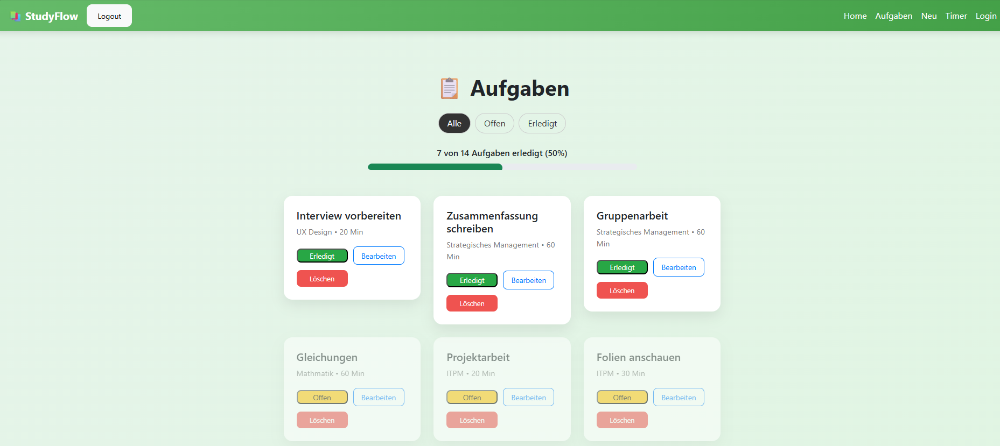
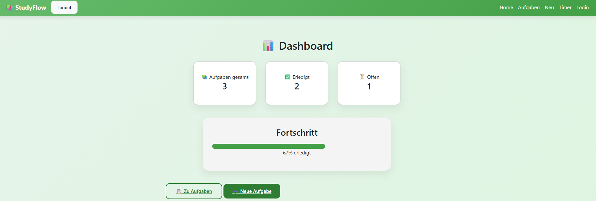
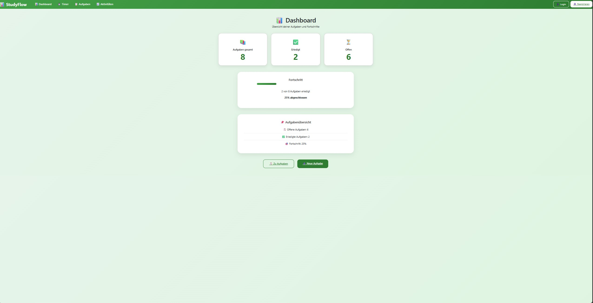
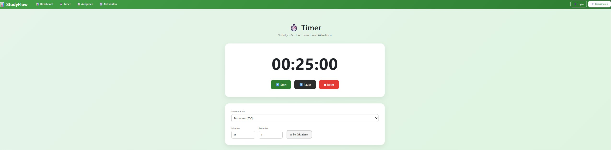
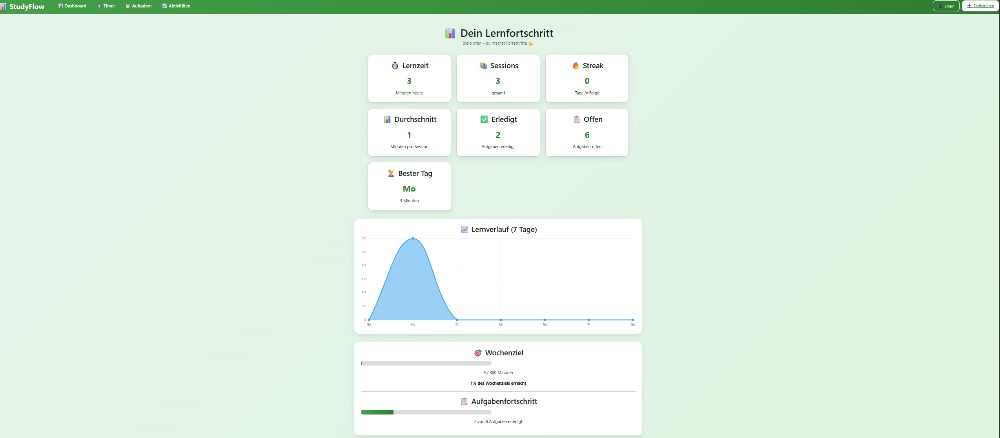

# Projektdokumentation - Studyflow

## Inhaltsverzeichnis

1. [Ausgangslage](#1-ausgangslage)
2. [Lösungsidee](#2-lösungsidee)
3. [Vorgehen & Artefakte](#3-vorgehen--artefakte)
    1. [Understand & Define](#31-understand--define)
    2. [Sketch](#32-sketch)
    3. [Decide](#33-decide)
    4. [Prototype](#34-prototype)
    5. [Validate](#35-validate)
4. [Erweiterungen [Optional]](#4-erweiterungen-optional)
5. [Projektorganisation [Optional]](#5-projektorganisation-optional)
6. [KI-Deklaration](#6-ki-deklaration)
7. [Anhang [Optional]](#7-anhang-optional)

> **Hinweis:** Massgeblich sind die im **Unterricht** und auf **Moodle** kommunizierten Anforderungen.

<!-- WICHTIG: DIE KAPITELSTRUKTUR DARF NICHT VERÄNDERT WERDEN! -->

<!-- Diese Vorlage ist für eine README.md im Repository gedacht. Abschnitte mit [Optional] können weggelassen werden, wenn in den Übungen nichts anderes verlangt wird. -->

## 1. Ausgangslage
Kurz beschreiben, welches Problem adressiert wird und welches Ergebnis angestrebt ist. Wem nützt die Lösung, wer ist beteiligt oder betroffen?
- **Problem:** Studierende haben oft mehrere Lernaufgaben gleichzeitig und verlieren den Überblick. Zudem fällt es vielen schwer, fokussiert zu lernen und Aufgaben konsequent abzuschliessen.  
- **Ziele:** _
Das Ziel des Projekts war die Entwicklung einer webbasierten Lernplattform für Studierende. Die Anwendung soll die Planung von Lernaufgaben vereinfachen, fokussiertes Arbeiten durch einen integrierten Timer unterstützen und den Lernfortschritt visualisieren.

Folgende Ziele wurden definiert:

- Übersicht über Lernaufgaben schaffen
- Fokus beim Lernen unterstützen
- Aufgaben einfach erstellen und verwalten
- Lernzeit automatisch erfassen
- Fortschritt sichtbar machen
- Motivation durch visuelles Feedback erhöhen

- **Primäre Zielgruppe:** Studierende, die ihre Lernaufgaben strukturieren und fokussierter arbeiten möchten

## 2. Lösungsidee
Beschreibt die Lösungsidee.
- **Kernfunktionalität:** _[Workflows kurz nennen und optional illustrieren]_  
- Aufgaben erstellen  
- Aufgaben verwalten (bearbeiten, löschen, filtern)  
- Fokus-Timer mit Start, Pause und Reset  
- Fokus-Session durchführen (Timer)  
- Automatische Speicherung der Lernzeit  
- Fortschritt in Statistik anzeigen 
- Übernahme der Zeit direkt aus einer Aufgabe
- Automatische Speicherung von Lernsessions

- **Annahmen [Optional]:** _[welche Hypothesen werden geprüft?]_
- Nutzer möchten einfache und schnelle Eingabe  
- Visuelles Feedback motiviert 

- **Abgrenzung [Optional]:** _[Was gehört explizit nicht zum Umfang?]_  
- Kein komplexes Zeittracking  
- Login und Registrierung
- Fortschritt in Statistik anzeigen

## 3. Vorgehen & Artefakte
Die Entwicklung der Anwendung erfolgte iterativ in mehreren Phasen. Ziel war es, eine funktionale und benutzerfreundliche Lern-App mit Timer, Aufgabenverwaltung und Statistik zu erstellen.

🔹 Phase 1: Grundstruktur & Setup

Zu Beginn wurde das Projekt mit SvelteKit eingerichtet und die grundlegende Ordnerstruktur erstellt. Zusätzlich wurde Bootstrap für das UI integriert.

Ergebnis: 
Funktionierende Projektstruktur
Layout mit Navigation (Navbar)
Routing zwischen Seiten

🔹 Phase 2: Aufgabenverwaltung (To-Do)

In dieser Phase wurde eine Aufgabenverwaltung implementiert, bei der Nutzer Aufgaben erstellen, anzeigen und als erledigt markieren können.

Features:
Aufgaben erstellen (Titel, Fach, Beschreibung, Dauer, Datum, Priorität)
Aufgabenliste anzeigen
Filter (Offen / Erledigt)
Löschen von Aufgaben
Aufgabe bearbeiten

Artefakte:
/tasks
MongoDB Collection tasks

🔹 Phase 3: Timer (Pomodoro)

Es wurde ein interaktiver Fokus-Timer entwickelt, der Nutzer beim strukturierten Lernen unterstützt.

Features:
- Start / Pause / Reset
- Timer läuft nach Pause korrekt weiter (kein Reset)
- Individuelle Zeitsteuerung (Minuten & Sekunden)
- Auswahl von Lernmethoden:
  - Pomodoro (25/5)
  - Deep Work (50/10)
  - Quick Session (15/3)

Erweiterung:
- Aufgaben können direkt mit dem Timer verknüpft werden
- Beim Start einer Aufgabe wird die Zeit automatisch übernommen
- Nach Beenden wird eine Lern-Session gespeichert

Artefakte:
/timer  
Session-Tracking

🔹 Phase 4: Benutzer-System (Login & Registrierung)
Ein einfaches Authentifizierungssystem wurde implementiert.

Features:
Registrierung neuer Nutzer
Login mit E-Mail und Passwort
Speicherung im Cookie
Logout

Wichtig:
Aufgaben sind benutzerspezifisch gespeichert

Artefakte:
/login, /register, /logout
MongoDB Collection users

🔹 Phase 5: Statistik / Aktivitäten
Es wurde eine Statistikseite entwickelt, die Lernaktivitäten visualisiert.

Features:
Gesamtlernzeit
Anzahl Sessions
Anzahl Streaks
Durschnitt
Anzahl erledigte Aufgabe
Anzahl offene Aufgaben
Bester Tag
Diagramm (Lernzeit pro Tag)
Wochenziel
Aufgabenfortschritt

Artefakte:
/stats
MongoDB Collection sessions

🔹 Phase 6: UI & Usability
Zum Abschluss wurde die Benutzeroberfläche verbessert.

Verbesserungen:
Listenansicht
Dashboard mit Übersicht
Login und Registrierung
Zusätzliche Filter
Priorität der Aufgaben

### 3.1 Understand & Define
- **Zielgruppenverständnis:** _[Problemraumanalyse, Recherche, (Proto-)Personas]_
Studierende arbeiten oft unter Zeitdruck und benötigen einfache Tools ohne Komplexität.
- **Wesentliche Erkenntnisse:** _[Stichpunkte]_
 - Einfachheit ist wichtiger als eine Vielzahl an Features  
 - Schnelle und unkomplizierte Eingabe von Aufgaben ist entscheidend  
 - Sichtbarer Fortschritt wirkt motivierend und steigert die Produktivität  
 - Kombination aus Aufgabenverwaltung und Timer unterstützt strukturiertes Lernen   

### 3.2 Sketch
- **Variantenüberblick:** _[kurz]_
Im Rahmen der Ideenfindung wurden verschiedene Layouts für die Aufgabenübersicht entworfen.

- **Skizzen:** _[Mehrere Varianten; Unterschiede kurz dokumentieren.]_
**Variante 1: Klassische Listenansicht**  

Eine einfache, textbasierte Liste mit Aufgaben untereinander.  
→ Vorteil: sehr übersichtlich und schnell erfassbar  
→ Nachteil: wirkt weniger modern und bietet wenig visuelle Struktur 

  **Variante 2: Kartenbasierte Darstellung**  

Aufgaben als Karten mit Buttons.  
→ Vorteil: moderne Darstellung, bessere Struktur  
→ Nachteil: mehr Platzbedarf   

 **Variante 3: Dashboard-Ansatz**  

Kombination aus Übersicht und Statistik.  
→ Vorteil: motivierend durch Fortschritt  
→ Nachteil: komplexer

### 3.3 Decide
- **Gewählte Variante & Begründung:**  
Es wurde eine Listenbasierte Aufgabenübersicht mit Fokus auf zentrale Kernfunktionen gewählt. Ziel war es, eine intuitive und übersichtliche Benutzeroberfläche zu schaffen, die den Nutzer nicht überfordert.

**Entscheidungskriterien:**
- Einfachheit und schnelle Bedienbarkeit  
- Klare visuelle Struktur der Aufgaben  
- Fokus auf die wichtigsten Funktionen (Erstellen, Bearbeiten, Abschließen)  
- Motivation durch sichtbaren Fortschritt  
- Klaren Deadlines
- Prioritäten

Die Listenansicht erfüllt diese Kriterien am besten, da sie Aufgaben klar voneinander trennt und gleichzeitig eine moderne und ansprechende Darstellung bietet.

---

- **End-to-End-Ablauf (User Journey):**

1. Nutzer öffnet Dashboard  
2. Nutzer erstellt Aufgabe  
3. Aufgabe erscheint in Übersicht  
4. Nutzer startet Timer direkt aus der Aufgabe  
5. Timer übernimmt automatisch die Dauer  
6. Nutzer pausiert oder beendet den Timer  
7. Lernsession wird automatisch gespeichert  
8. Statistik zeigt Fortschritt an
9. Nutzer kann die gespeicherten Daten im Statistik-Dashboard analysieren

---

- **Mockup (Screenshots der finalen Umsetzung):**

  
*Dashboard mit Fortschrittsanzeige und Überblick über Aufgaben*

  
*Kartenbasierte Darstellung der Aufgaben mit Aktionen*

  
*Formular zur Erstellung neuer Aufgaben*

  
*Fokus-Timer zur Bearbeitung von Aufgaben*

  
*Übersicht über Lernzeit und Sessions*

### 3.4 Prototype

#### 3.4.1. Entwurf (Design)
Beschreibt die Gestaltung und Interaktion.
> **Hinweis:** Hier wird der **Prototyp** beschrieben, nicht das **Mockup**.
- **Informationsarchitektur:** _[z. B. Seiten/Navigation: Konzept, nicht die technische Umsetzung]_
Die Anwendung ist in mehrere zentrale Bereiche unterteilt, die über eine einfache Navigationsleiste erreichbar sind:

- Dashboard (Startseite) → Übersicht über Aufgaben und Fortschritt  
- Aufgabenübersicht (/tasks) → Anzeige und Verwaltung aller Aufgaben  
- Neue Aufgabe erstellen (/tasks/new) → Formular zur Eingabe neuer Aufgaben  
- Timer (/timer) → Fokus-Timer zur Bearbeitung von Aufgaben  
- Statistik (/stats) → Übersicht über Lernzeit und Sessions  

Die Struktur wurde bewusst einfach gehalten, um eine schnelle Orientierung zu ermöglichen und unnötige Komplexität zu vermeiden.

- **User Interface Design:** _[wichtige Screens: Screenshots mit kurzen Erläuterungen]_  
  
*Das Dashboard zeigt eine Übersicht über alle Aufgaben sowie den aktuellen Fortschritt.*

  
*Die Aufgaben werden in Form von Karten dargestellt, mit klaren Aktionen wie „Erledigt“, „Bearbeiten“ und „Löschen“.*

  
*Ein einfaches Formular ermöglicht die schnelle Erstellung neuer Aufgaben.*

  
*Der Timer unterstützt den Nutzer beim fokussierten Arbeiten und kann Aufgaben direkt abschließen.*

- **Designentscheidungen:** _[zentrale Entscheidungen und Begründungen]_
- Fokus auf Einfachheit und Klarheit, um die Nutzung intuitiv zu gestalten  
- Verwendung von Karten (Cards) zur besseren visuellen Trennung der Aufgaben  
- Klare Call-to-Action Buttons (z. B. „Erledigt“, „Speichern“) für schnelle Interaktion  
- Farbige Statusanzeigen (z. B. grün für erledigt, grau für offen) zur schnellen Orientierung  
- Konsistente Navigation über alle Seiten hinweg  

Die Gestaltung orientiert sich an bekannten UI-Mustern, um die Bedienbarkeit zu erhöhen und die Lernkurve für neue Nutzer gering zu halten.

#### 3.4.2. Umsetzung (Technik)
Fasst die technische Realisierung zusammen.
- **Technologie-Stack:** _[SvelteKit, Bibliotheken falls genutzt]_
Die Anwendung wurde mit modernen Web-Technologien umgesetzt:

- SvelteKit (Frontend + Server-Routing)  
- MongoDB Atlas (Datenbank)  
- Netlify (Deployment und Hosting)  
- Chart.js für die Darstellung von Lernstatistiken

SvelteKit ermöglicht eine klare Trennung zwischen Client- und Serverlogik sowie ein effizientes Routing.

- **Tooling:** _[IDE/Erweiterungen, lokale/Cloud-Tools; den Einsatz von KI beschreiben Sie im Kapitel **KI-Deklaration**]_  
Für die Entwicklung wurden folgende Tools verwendet:

- Visual Studio Code als Entwicklungsumgebung  
- Git & GitHub zur Versionsverwaltung und Dokumentation

- **Struktur & Komponenten:** _[Seiten, Routen, State/Stores, wichtige Komponenten]_
Die Anwendung ist modular aufgebaut und folgt der Struktur von SvelteKit:

- Seiten (Routes):  
  - `/` (Dashboard)  
  - `/tasks` (Aufgabenübersicht)  
  - `/tasks/new` (Neue Aufgabe erstellen)  
  - `/tasks/[id]/edit` (Aufgabe bearbeiten)  
  - `/timer` (Fokus-Timer)  
  - `/stats` (Statistik)  

- Komponenten:  
  - `TaskCard.svelte` zur Darstellung einzelner Aufgaben   

Diese Struktur ermöglicht eine gute Wartbarkeit und Wiederverwendbarkeit von Komponenten. 

- **Daten & Schnittstellen:** _[Wie werden Daten gespeichert, verwaltet, abgerufen?]_
Die Daten werden in MongoDB gespeichert und über Server-Funktionen (PageServerLoad und Actions) verarbeitet.

- Aufgaben werden in der Collection `tasks` gespeichert  
- Sessions (Timer-Daten) werden in der Collection `sessions` gespeichert  
- Daten werden serverseitig geladen und als Props an die Seiten übergeben
- Der Fokus-Timer speichert nach jeder Nutzung automatisch eine Lernsitzung 
  in der Datenbank (MongoDB). Diese Daten werden in der Statistik aggregiert 
  und visuell als Diagramm dargestellt.  

Die Kommunikation erfolgt über HTTP-Requests und Form-Actions.
- Der Timer ist direkt mit Aufgaben verknüpft:
  - Beim Start einer Aufgabe wird die Dauer automatisch übernommen
  - Übergabe erfolgt über URL-Parameter (`?minutes=XX`)
  - Dadurch entsteht ein durchgängiger Workflow zwischen Aufgaben und Timer

- Timer-Sessions werden automatisch gespeichert:
  - Dauer wird in MongoDB (`sessions`) gespeichert
  - Diese Daten werden in der Statistik visualisiert (Diagramm + Fortschritt)

- **Deployment:** _[URL]_  
https://studyflow-app-pt.netlify.app/

- **Besondere Entscheidungen:** _[z. B. Trade-offs, Vereinfachungen]_  

- Verwendung von serverseitigen Actions statt komplexer API-Strukturen → einfachere Architektur  
- Speicherung von User-Daten über Cookies → einfache Authentifizierung  
- Fokus auf Minimalismus statt Feature-Overload → bessere Usability
- Zur Verbesserung der Benutzerfreundlichkeit wurde ein Demo-Modus integriert. 
  Nicht eingeloggte Nutzer sehen automatisch Beispielaufgaben eines Test-Users. 
  Dies ermöglicht es insbesondere Testpersonen, die Anwendung sofort zu verstehen und auszuprobieren, 
  ohne einen Account erstellen zu müssen. 

### 3.5 Validate
- **URL der getesteten Version** (separat deployt)
https://6a0d97afc4563100089a31bd--studyflow-app-pt.netlify.app/

- **Ziele der Prüfung:** _[welche Fragen sollen beantwortet werden?]_  
- Ist der Workflow verständlich und intuitiv?  
- Können Nutzer Aufgaben problemlos erstellen, bearbeiten und abschließen?  
- Werden mögliche Schwächen in der Bedienung erkannt?    

- **Vorgehen:** _[moderiert/unmoderiert; remote/on-site]_  
Es wurde ein moderierter Usability-Test mit zwei Testpersonen durchgeführt.  
Die Testpersonen wurden gebeten, typische Aufgaben auszuführen und dabei laut zu denken.  
Beobachtungen und Feedback wurden dokumentiert.

- **Stichprobe:** _[Mit wem wurde getestet? Profil; Anzahl]_  
- 2 Studierende (Zielgruppe)  
- Beide mit grundlegender Erfahrung im Umgang mit Webanwendungen  

- **Aufgaben/Szenarien:** _[Ausformulierte Testaufgaben]_  
- Neue Aufgabe erstellen  
- Aufgabe als erledigt markieren  
- Aufgaben filtern (offen/erledigt)  
- Aufgabe bearbeiten  
- Aufgabe löschen 
- Timer starten

- **Kennzahlen & Beobachtungen:** _[z. B. Erfolgsquote, Zeitbedarf, qualitative Findings]_  
Alle Aufgaben wurden von beiden Testpersonen mit **5/5 (sehr einfach)** bewertet.

**Positive Beobachtungen:**
- Erstellung von Aufgaben war sehr einfach  
- Aufgaben konnten intuitiv als erledigt markiert werden  
- Filterfunktion funktionierte problemlos  
- Dashboard und Timer wurden als hilfreich und übersichtlich bewertet

**Probleme / Verbesserungspotenzial:**
- Unklare Zeitangabe („Dauer“ → Minuten/Stunden nicht ersichtlich)
- Negative Werte bei Minuten möglich → keine Validierung
- Erledigte Aufgaben bleiben sichtbar → nicht eindeutig genug hervorgehoben
- Löschen von Aufgaben funktionierte teilweise nicht (Fehler/404)
- Timer nicht flexibel genug (fix auf 25 Minuten)

- **Zusammenfassung der Resultate:** _[Wichtigste Erkenntnisse; 2-4 Sätze]_ 
Die Anwendung wurde von beiden Testpersonen als sehr einfach und verständlich bewertet.  
Alle Kernfunktionen konnten erfolgreich genutzt werden.  
Die identifizierten Probleme betreffen hauptsächlich kleinere Usability-Aspekte und technische Details, nicht den grundlegenden Workflow.

- **Abgeleitete Verbesserungen:** _[Anforderungen, die als nächstes umgesetzt werden sollten, priorisiert, kurz begründet; falls Verbesserungen im Prototyp konkret umgesetzt wurden: In Kap. 4 dokumentieren]_  
1. Eingabevalidierung verbessern (keine negativen Werte)  
2. Einheit bei Zeitangaben klar anzeigen (Minuten)  
3. Visuelle Darstellung von erledigten Aufgaben verbessern  
4. Fehler beim Löschen von Aufgaben beheben  
5. Timer flexibler gestalten (individuelle Dauer möglich)  

Einige dieser Verbesserungen wurden im weiteren Verlauf bereits umgesetzt (z. B. Login-System, Timer-Anpassungen).
Weitere umgesetzte Verbesserungen:

- Timer pausiert jetzt korrekt und startet nicht mehr neu
- Individuelle Zeitsteuerung implementiert
- Aufgaben mit Timer verknüpft
- Benutzeroberfläche deutlich vergrößert und übersichtlicher gestaltet
- Statistik erweitert (Diagramm + Fortschrittsbalken)

## 4. Erweiterungen [Optional]
Dokumentiert Erweiterungen über den Mindestumfang hinaus.
> **Hinweis:** Jede Erweiterung ist separat nach dem folgenden Schema zu beschreiben.

### _[4.x Kurzbeschreibung / Titel]_  
- **Beschreibung & Nutzen:** _[Was wurde erweitert? Warum?]_  
- **Wo umgesetzt:** _[Wie und wo wurde es gemacht? Frontend, Backend, Datenbank?]_  
- **Referenz:** _[Wo wird die Erweiterung auch noch beschrieben, z.B. Screenshot oder Beschreibung in einem anderen Kapitel]_  
- **Aus Evaluation abgeleitet?:** _[Wurde diese Erweiterung als Folge eines in der Evaluation identifizierten Issues implementiert?]_ 

### 4.1 Timer mit automatischer Aktivitätsspeicherung
- **Beschreibung & Nutzen:**  
Der Timer wurde so erweitert, dass beim Pausieren oder Beenden automatisch eine Lernsession gespeichert wird. Dadurch muss der Nutzer nichts manuell erfassen und erhält automatisch eine Übersicht über seine Lernzeit.

- **Wo umgesetzt:**  
  - **Frontend:** Timer-Logik in `/timer/+page.svelte` (saveSession Funktion)  
  - **Backend:** Action `completeFromTimer` in `/tasks/+page.server.ts`  
  - **Datenbank:** Speicherung in der Collection `sessions`  

- **Referenz:** Statistik-Seite (Kapitel 3.4, Screenshot Statistik)

- **Aus Evaluation abgeleitet?:**  
Ja – Nutzer wollten weniger manuelle Eingaben und einfachere Nutzung des Timers

### 4.2 Statistik-Dashboard (Lernzeit & Sessions)
- **Beschreibung & Nutzen:**  
Es wurde eine Statistik-Seite implementiert, die die gesamte Lernzeit sowie die Anzahl der Sessions anzeigt. Dies erhöht die Motivation durch sichtbaren Fortschritt.

- **Wo umgesetzt:**  
  - **Frontend:** `/stats/+page.svelte`  
  - **Backend:** `/stats/+page.server.ts`  
  - **Datenbank:** Auswertung der `sessions` Collection  

- **Referenz:** Screenshot Statistik (Kapitel 3.4)

- **Aus Evaluation abgeleitet?:**  
Teilweise – Fortschritt wurde als motivierend bewertet

### 4.3 Benutzer-Login & personalisierte Daten
- **Beschreibung & Nutzen:**  
Ein Login-System wurde integriert, sodass jeder Nutzer nur seine eigenen Aufgaben sieht. Dadurch wird die Anwendung realistisch nutzbar und datengetrennt.

- **Wo umgesetzt:**  
  - **Frontend:** Login/Register Seiten (`/login`, `/register`)  
  - **Backend:** Cookie-basierte Authentifizierung  
  - **Datenbank:** User-Collection + Verknüpfung über `userId`  

- **Referenz:** Navigation + Aufgabenübersicht

- **Aus Evaluation abgeleitet?:**  
Ja – Wunsch nach persönlichem Login wurde geäussert

### 4.4 Fortschrittsanzeige im Dashboard
- **Beschreibung & Nutzen:**  
Ein Fortschrittsbalken zeigt an, wie viele Aufgaben erledigt sind. Dies unterstützt die Motivation und gibt sofort visuelles Feedback.

- **Wo umgesetzt:**  
  - **Frontend:** Dashboard (`/+page.svelte`)  
  - **Backend:** Berechnung in `+page.server.ts`  

- **Referenz:** Dashboard Screenshot (Kapitel 3.4)

- **Aus Evaluation abgeleitet?:**  
Nein, aber unterstützt Motivation (indirekt bestätigt)

### 4.5 Filterfunktion für Aufgaben (Offen / Erledigt)
- **Beschreibung & Nutzen:**  
Nutzer können Aufgaben nach Status filtern. Dies verbessert die Übersicht bei vielen Aufgaben.

- **Wo umgesetzt:**  
  - **Frontend:** Filter-Buttons in `/tasks/+page.svelte`  
  - **Backend:** Query-Filter in `/tasks/+page.server.ts`  

- **Referenz:** Aufgabenübersicht Screenshot

- **Aus Evaluation abgeleitet?:**  
Nein, aber usability-relevant

### 4.6 Verbesserte Validierung von Eingaben
- **Beschreibung & Nutzen:**  
Fehlerhafte Eingaben (z. B. negative Minuten) werden verhindert. Dadurch wird die Datenqualität verbessert und Fehler reduziert.

- **Wo umgesetzt:**  
  - **Frontend:** Formularvalidierung  
  - **Backend:** Checks in Actions (`+page.server.ts`)  

- **Referenz:** Neue Aufgabe Formular

- **Aus Evaluation abgeleitet?:**  
Ja – negative Werte wurden im Test bemängelt

> Das folgende **Beispiel** wurde bewusst kurz gehalten. Erweiterungen dürfen auch ausführlicher beschrieben werden.

### 4.1 Tabelle nach Kategorien filtern
- **Beschreibung & Nutzen:** Tabelle X kann nach Kategorie gefiltert werden, weil User typischerweise nur an einer bestimmten Kategorie interessiert sind.  
- **Wo umgesetzt:** 
  - **Frontend:** Tabelle mit Dropdown in Datei ...
  - **Backend:** Form Action ... in Datei ...
  - **Datenbank:** MongoDB-Query in Datei ...
- **Referenz:** Screenshot in Kap. x.y
- **Aus Evaluation abgeleitet?:** Ja, Issue x.y

## 5. Projektorganisation [Optional]
Beispiele:
- **Repository & Struktur:** _[Link; kurze Strukturübersicht]_ 
https://github.com/lorenastudent8/studyflow-app

Das Projekt wurde über GitHub verwaltet. Die Struktur folgt einer klaren Trennung zwischen Frontend und Backend-Logik.  
Die Benutzeroberfläche wurde mit SvelteKit umgesetzt, während die Datenverarbeitung über Server-Routes erfolgt.  
Wichtige Verzeichnisse sind:
- `/routes`: Seiten und Navigation  
- `/lib`: wiederverwendbare Komponenten und Logik  
- `/server`: Datenbankzugriff (MongoDB)

- **Issue-Management:** _[Vorgehen kurz beschreiben]_ 
Probleme wurden während der Entwicklung direkt identifiziert und behoben (z. B. Timer-Fehler, Datenbankprobleme).

- **Commit-Praxis:** _[z. B. sprechende Commits]_
Es wurden sprechende Commits verwendet, die Änderungen verständlich dokumentieren (z. B. „fix dashboard types“, „Styling verbessert“).  
Teilweise wurden auch allgemeinere Commit-Nachrichten verwendet, im weiteren Verlauf wurde jedoch stärker auf klare Beschreibungen geachtet.

## 6. KI-Deklaration
Die folgende Deklaration ist verpflichtend und beschreibt den Einsatz von KI im Projekt.

### 6.1 KI-Tools
- **Eingesetzte Tools**: _[z. B. Copilot, ChatGPT, Claude, lokale Modelle; Version/Variante wenn bekannt]_
- ChatGPT wurde zur Unterstützung verwendet  

- **Zweck & Umfang**: _[wie, wofür und in welchem Ausmass wurde KI eingesetzt (z. B. Textentwürfe, Codevorschläge, Tests, Refactoring); welche Teile stammen (ganz/teilweise) aus KI-Unterstützung?]_
- Unterstützung bei der Entwicklung von SvelteKit-Komponenten
- Debugging von Datenbank- und Routing-Problemen
- Unterstützung bei MongoDB-Abfragen
- Hilfe bei UI-Verbesserungen
- Unterstützung bei der Erstellung der Projektdokumentation 

- **Eigene Leistung (Abgrenzung):** _[was ist eigenständig erarbeitet/überarbeitet worden?]_
- Anpassung und Verständnis des Codes  
- eigenständige Umsetzung 

### 6.2 Prompt-Vorgehen
_[Überlegungen zu Prompt-Vorgehen, Qualität und Urheberrecht/Quellen. Wie wurde beim Prompting vorgegangen? Zu beschreiben ist die grundlegende Vorgehensweise. Einzelne, konkrete Prompts sollten höchstens als Beispiele aufgeführt werden. ]_
Die KI wurde gezielt eingesetzt, um konkrete Probleme zu lösen (z. B. Fehler im Code oder neue Features wie Timer oder Statistik).

Vorgehen:
- Problem klar formuliert
- Code oder Fehlermeldung angegeben
- Lösungsvorschläge geprüft und angepasst
- Ergebnisse eigenständig integriert und getestet

Beispiel:
„Warum werden meine Tasks nicht gespeichert, obwohl die Daten korrekt übergeben werden?“  
→ Die KI half, einen Fehler in der Feldbenennung zu identifizieren.

Die KI diente als Unterstützung, nicht als Ersatz für eigenes Verständnis.

### 6.3 Reflexion
_[Nutzen, Grenzen, Risiken/Qualitätssicherung, ...]_
Der Einsatz von KI war sehr hilfreich, insbesondere bei:
- Debugging
- Strukturierung des Codes
- Umsetzung neuer Funktionen

Grenzen:
- Vorschläge mussten oft angepasst werden
- Verständnis des Codes war weiterhin notwendig

Risiken:
- Blindes Übernehmen hätte zu Fehlern geführt

Fazit:
KI war ein wertvolles Hilfsmittel, konnte aber die eigene Entwicklung und das Verständnis nicht ersetzen.

## 7. Anhang [Optional]
Beispiele:
- **Quellen:** _[verwendete Vorlagen/Assets/Modelle; Lizenz/Urheberrecht; ...]_
- **Testskript & Materialien:** _[Link/Datei]_  
- **Rohdaten/Auswertung:** _[Link/Datei]_  

